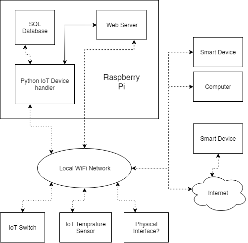
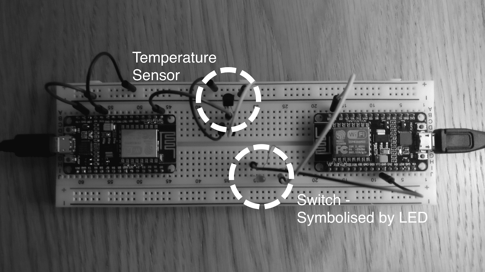
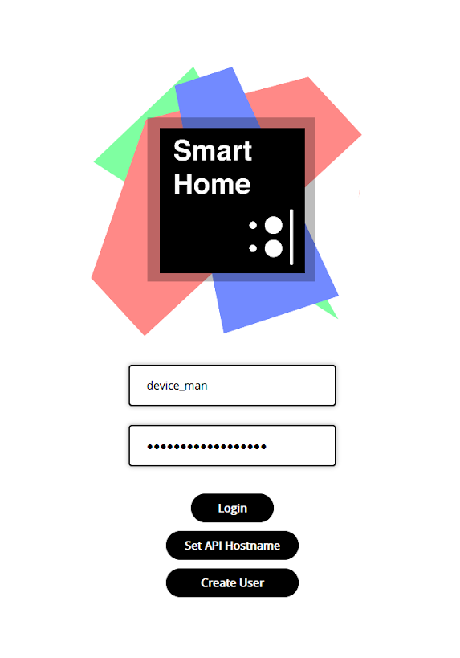
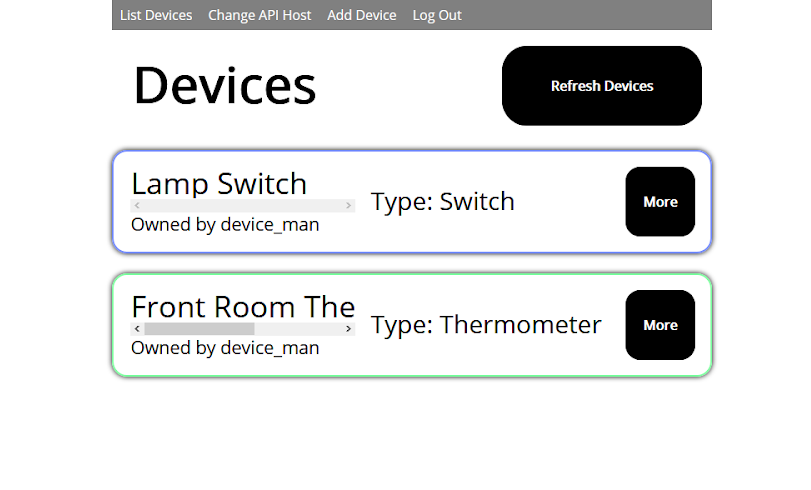
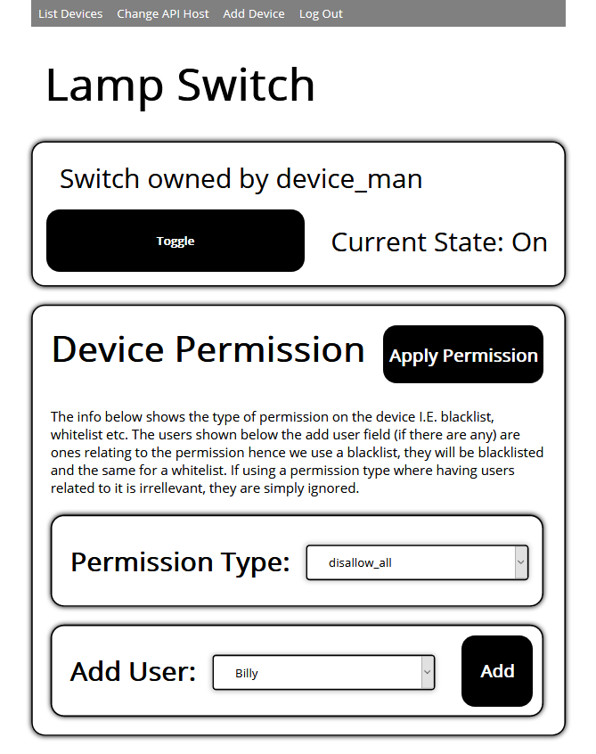

# A Level Smart Home

**See ```[documentation/design_document.pdf](documentation/design_document.pdf)``` for detailed design notes and documentation.**

## Preface

This project was written as part of my computer science A-Level during sixth form. The code is certainly not perfect, and I would definitely change many of the ways I have approached accomplishing certain tasks here. Yet it works well - and demonstrates core skills.

## About

This project creates a _smart home_ controller on a Raspberry Pi. Clients can then connect to this controller over the local (or non local with port forwarding) network. The controller is implemented using Flask to create a REST API to which the clients can use to control and monitor the home.

A web server is also hosted on this controller which uses AJAX to dynamically change its self and send commands to the controller.

<p align="center">
    
    <br> A data flow diagram for the system.
</p>

The IoT devices that this home controls are based on a an ESP8266 microcontroller onto which I loaded [MicroPython](https://micropython.org).

<p align="center">
    
    <br> 2 IoT devices a thermometer (left) and a switch (right).
</p>

The controller queries and controls the IoT devices by sending commands over the network using network sockets in Python.

# Screenshots

## Main login screen

<p align="center">
    
</p>

## Devices list

<p align="center">
    
</p>

## Device interface page

<p align="center">
    
</p>


